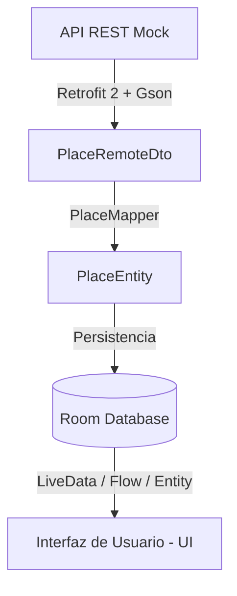
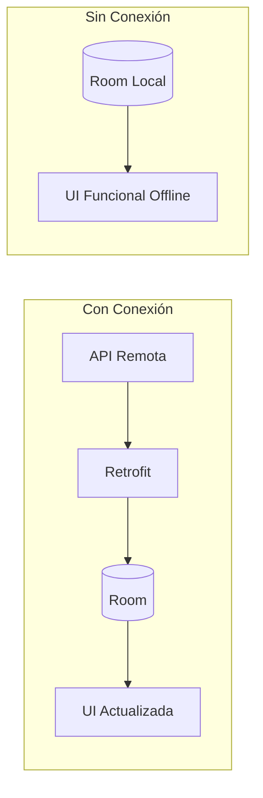

# 🧭 ITANES — Lima Metropolitana

## 📌 Descripción

**ITANES — Lima Metropolitana** es una aplicación móvil Android desarrollada como Trabajo Final del curso **Desarrollo de Aplicaciones Móviles**.

La app permite explorar los destinos históricos, culturales y costeros más emblemáticos de Lima mediante una experiencia fluida e interactiva. Implementa persistencia local en SQLite con Room, sincronización de datos desde una API REST bajo arquitectura **Offline-First**, renderizado de mapas vectoriales con MapLibre y navegación guiada a través de intents nativos de Android.

> El propósito central del proyecto consiste en demostrar la cohesión de servicios web, persistencia interna, renderizado geoespacial y patrones arquitectónicos modernos en una solución móvil funcional.

---

## ✨ Funcionalidades principales

* **Navegación e Interfaz:**
* Identidad visual propia inspirada en el turismo nacional.
* Menú inferior con `BottomNavigationView` para cambio rápido de pantallas.
* Compatibilidad dinámica con modo claro, modo oscuro y seguimiento del sistema con `AppCompatDelegate`.


* **Manejo de Datos y Red:**
* Consumo de servicios REST mediante `Retrofit` y mapeo de datos con `Gson`.
* Sincronización transparente con almacenamiento local en base de datos `Room`.
* Arquitectura **Offline-First**: el usuario puede navegar por los destinos guardados aun si pierde conectividad.


* **Detalle y Geolocalización:**
* Listado y pantalla de detalle con soporte de imágenes remotas en caché gracias a `Glide`.
* Visualización geoespacial de atractivos mediante mapas vectoriales de `MapLibre` y `OpenFreeMap`.
* Trazado de rutas y ubicación externa mediante `Intent.ACTION_VIEW`.
* Opción para compartir la ficha informativa del lugar mediante `Intent.ACTION_SEND`.
* Persistencia de lugares favoritos en base de datos local.


---

## 🏛️ Destinos incluidos

| # | Lugar turístico | Distrito | Latitud | Longitud |
| --- | --- | --- | --- | --- |
| 1 | **Plaza Mayor de Lima** | Cercado de Lima | `-12.046374` | `-77.029718` |
| 2 | **Huaca Pucllana** | Miraflores | `-12.111116` | `-77.033481` |
| 3 | **Circuito Mágico del Agua** | Cercado de Lima | `-12.069904` | `-77.033555` |
| 4 | **Parque del Amor** | Miraflores | `-12.132865` | `-77.034614` |
| 5 | **Museo Larco** | Pueblo Libre | `-12.072412` | `-77.070868` |

---

## 🧱 Arquitectura de datos

La aplicación aísla el origen de los datos a través del patrón repositorio. La interfaz de usuario nunca invoca directamente a la API externa; la única fuente de verdad para la vista es la base de datos interna.



### Comportamiento de sincronización



---

## 🗂️ Estructura del proyecto

```text
app/
└── src/main/
    ├── java/pe/itanes/app/
    │   ├── data/
    │   │   ├── local/
    │   │   │   ├── dao/
    │   │   │   │   ├── PlaceDao.java
    │   │   │   │   └── FavoriteDao.java
    │   │   │   ├── database/
    │   │   │   │   └── AppDatabase.java
    │   │   │   └── entity/
    │   │   │       ├── PlaceEntity.java
    │   │   │       └── FavoriteEntity.java
    │   │   ├── mapper/
    │   │   │   └── PlaceMapper.java
    │   │   ├── remote/
    │   │   │   ├── api/
    │   │   │   │   └── PlacesApiService.java
    │   │   │   ├── dto/
    │   │   │   │   └── PlaceRemoteDto.java
    │   │   │   └── retrofit/
    │   │   │       └── RetrofitClient.java
    │   │   └── repository/
    │   │       └── PlaceRepository.java
    │   └── ui/
    │       ├── home/
    │       ├── places/
    │       ├── favorites/
    │       ├── map/
    │       └── detail/
    └── res/
        ├── layout/
        ├── layout-sw600dp/
        ├── drawable/
        ├── values/
        └── values-night/

api/
└── places.json

```

---

## 🛠️ Tecnologías y librerías

| Herramienta | Tipo | Finalidad |
| --- | --- | --- |
| **Java** | Lenguaje | Lógica de negocio y ciclo de vida de componentes |
| **Android XML** | Maquetación | Vistas dinámicas, jerarquías adaptables y themes |
| **Room** | Persistencia | Abstracción de SQLite para arquitectura local segura |
| **Retrofit 2** | Red | Cliente HTTP tipado para consumo de endpoints REST |
| **Gson** | Serialización | Parseo automático de JSON a modelos POJO |
| **Glide** | Multimedia | Descarga, renderizado y gestión de memoria de imágenes |
| **MapLibre Native** | Mapas | Renderizado vectorial de coordenadas y capas cartográficas |
| **OpenFreeMap / OSM** | Cartografía | Servidor de teselas libres sin dependencia de API keys |
| **Git / GitHub** | Versiones | Control de versiones distribuido y colaboración |

---

## 🌐 API REST Mock (`api/places.json`)

Los datos iniciales se gestionan y distribuyen con el siguiente esquema JSON:

```json
[
  {
    "id": 1,
    "name": "Plaza Mayor de Lima",
    "shortDescription": "Centro fundacional y corazón histórico de la capital peruana.",
    "description": "Rodeada por la Catedral de Lima, el Palacio de Gobierno y el Palacio Municipal. Declarada Patrimonio de la Humanidad por la UNESCO.",
    "address": "Plaza Central s/n, Cercado de Lima, Lima, Perú",
    "latitude": -12.046374,
    "longitude": -77.029718,
    "imageUrl": "https://upload.wikimedia.org/wikipedia/commons/thumb/c/c5/Plaza_Mayor_de_Lima.jpg/800px-Plaza_Mayor_de_Lima.jpg",
    "orderNumber": 1,
    "updatedAt": "2026-09-15"
  },
  {
    "id": 2,
    "name": "Huaca Pucllana",
    "shortDescription": "Gran pirámide ceremonial de adobe perteneciente a la cultura Lima.",
    "description": "Complejo arqueológico edificado en el siglo V d.C. compuesto por una pirámide de 25 metros de altura con técnica de librero.",
    "address": "Calle General Borgoño cuadra 8, Miraflores, Lima, Perú",
    "latitude": -12.111116,
    "longitude": -77.033481,
    "imageUrl": "https://upload.wikimedia.org/wikipedia/commons/thumb/1/1a/Huaca_Pucllana_Lima_Peru.jpg/800px-Huaca_Pucllana_Lima_Peru.jpg",
    "orderNumber": 2,
    "updatedAt": "2026-09-15"
  },
  {
    "id": 3,
    "name": "Circuito Mágico del Agua",
    "shortDescription": "Complejo de fuentes cibernéticas con luces láser y música.",
    "description": "Ubicado en el Parque de la Reserva, ostenta el récord de fuentes ornamentales en un recinto público con espectáculos interactivos.",
    "address": "Jr. Madre de Dios s/n, Cercado de Lima, Lima, Perú",
    "latitude": -12.069904,
    "longitude": -77.033555,
    "imageUrl": "https://upload.wikimedia.org/wikipedia/commons/thumb/5/50/Circuito_Magico_del_Agua_Lima.jpg/800px-Circuito_Magico_del_Agua_Lima.jpg",
    "orderNumber": 3,
    "updatedAt": "2026-09-15"
  },
  {
    "id": 4,
    "name": "Parque del Amor",
    "shortDescription": "Espacio costero con vistas panorámicas a la bahía de Lima.",
    "description": "Parque inaugurado el 14 de febrero de 1993, reconocible por la escultura 'El Beso' de Víctor Delfín y muros con citas poéticas.",
    "address": "Malecón Cisneros s/n, Miraflores, Lima, Perú",
    "latitude": -12.132865,
    "longitude": -77.034614,
    "imageUrl": "https://upload.wikimedia.org/wikipedia/commons/thumb/7/7b/Parque_del_Amor_Miraflores.jpg/800px-Parque_del_Amor_Miraflores.jpg",
    "orderNumber": 4,
    "updatedAt": "2026-09-15"
  },
  {
    "id": 5,
    "name": "Museo Larco",
    "shortDescription": "Incomparable colección de arte precolombino en una casona virreinal.",
    "description": "Fundado en 1926, alberga más de 5,000 años de historia del Perú antiguo, exhibiendo piezas de oro, textiles y cerámica preincaica.",
    "address": "Av. Simón Bolívar 1515, Pueblo Libre, Lima, Perú",
    "latitude": -12.072412,
    "longitude": -77.070868,
    "imageUrl": "https://upload.wikimedia.org/wikipedia/commons/thumb/3/36/Museo_Larco_Herrera_Lima.jpg/800px-Museo_Larco_Herrera_Lima.jpg",
    "orderNumber": 5,
    "updatedAt": "2026-09-15"
  }
]

```

---

## 💾 Modelo de entidades locales

### Tabla `places`

```sql
CREATE TABLE places (
    id INTEGER PRIMARY KEY,
    name TEXT NOT NULL,
    shortDescription TEXT,
    description TEXT,
    address TEXT,
    latitude REAL NOT NULL,
    longitude REAL NOT NULL,
    imageUrl TEXT,
    orderNumber INTEGER,
    updatedAt TEXT
);

```

### Tabla `favorites`

```sql
CREATE TABLE favorites (
    placeId INTEGER PRIMARY KEY,
    createdAt TEXT NOT NULL,
    FOREIGN KEY(placeId) REFERENCES places(id) ON DELETE CASCADE
);

```

---

## 🚀 Instalación y compilación

1. **Obtener el código fuente:**
```bash
git clone https://github.com/Jotta1921/ITANES.git

```


2. **Abrir el entorno:**
* Inicia Android Studio y presiona **Open**.
* Selecciona el directorio clonado `ITANES`.


3. **Compilar y resolver dependencias:**
* Espera la indexación y sincronización de Gradle (`Sync Project with Gradle Files`).


4. **Desplegar la app:**
* Conecta un dispositivo físico o ejecuta un emulador con versión **Android 7.0 (API 24)** o superior.
* Presiona el botón **Run** (`Shift + F10`).


---

## 🧪 Pruebas y validaciones técnicas

* [x] **Consumo REST:** Petición HTTP síncrona/asíncrona y deserialización JSON sin bloqueos en el hilo principal (*UI Thread*).
* [x] **Persistencia Offline:** Consulta inmediata de registros guardados en SQLite aun con el modo avión activado.
* [x] **Ciclo de vida:** Conservación de datos y estado de vistas ante cambios de configuración (rotación de pantalla).
* [x] **Integración MapLibre:** Carga adecuada de estilos vectoriales y cálculo correcto de marcadores geográficos.
* [x] **Adaptabilidad:** Verificación en pantallas con ancho mayor a 600dp (`layout-sw600dp`) y modo nocturno (`values-night`).

---

## 👨‍💻 Desarrollador

* **Autor:** Josué Caleb Yovera Yovera
* **GitHub:** [@Jotta1921](https://www.google.com/search?q=https://github.com/Jotta1921&utm_source=gemini)
* **Especialidad:** Desarrollo de Software
* **Entorno Académico:** Trabajo Final — Desarrollo de Aplicaciones Móviles

---
